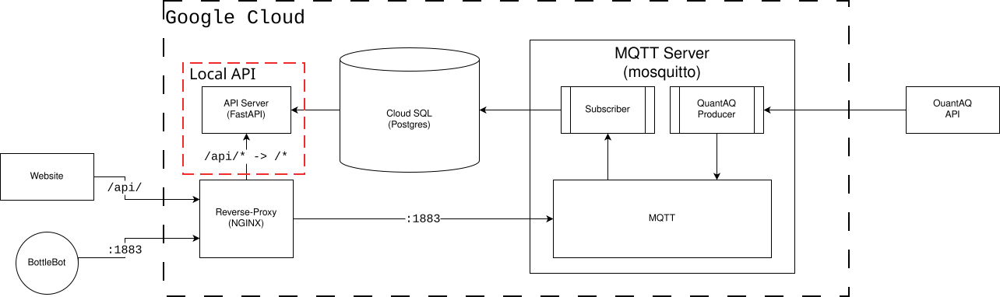

# The Blueprint Foundation: "Change is in the Air" API

## Overview

The 'bridge' between the backend (Database containing all synthetic and real sensor data) and the frontend (Web application interface).

Acts through a process of:

1) Pulling the sensor information from the backend database.
2) Organizing collected data into a comprehensible format for use by frontend.
3) Presenting data to respective data collection location.

- [The Blueprint Foundation: "Change is in the Air" API](#the-blueprint-foundation-change-is-in-the-air-api)
  - [Overview](#overview)
  - [Prerequisites](#prerequisites)
  - [Connection to Hosted Database](#connection-to-hosted-database)
  - [PostgreSQL](#postgresql)
  - [Python](#python)
  - [Beekeeper Studio](#beekeeper-studio)
  - [pgAdmin](#pgadmin)
  - [Application Deployment](#application-deployment)

## Prerequisites

Your system will need to have the following programs installed: 

- Connection to Hosted Database ([More Information](https://github.com/The-Blueprint-Foundation/TBF-Infrastructure/blob/main/README.md))
- PostgreSQL ([Installation Page](https://www.postgresql.org/download/)), ([Installation Guide](https://www.postgresql.org/docs/current/tutorial-install.html))
- Python 3.15 or newer ([Installation Page](https://www.python.org/downloads/)), ([Installation Guide](https://wiki.python.org/moin/BeginnersGuide(2f)Download.html))
- Optional: 
  - A Visual database manager, capable of interfacing with PostgreSQL \
Examples:
    - Beekeeper Studio ([Website](https://www.beekeeperstudio.io/)), ([Installation Guide](https://docs.beekeeperstudio.io/installation/))
    - pgAdmin ([Installation Page](https://www.pgadmin.org/download/)), ([Documentation](https://www.pgadmin.org/docs/pgadmin4/9.17/index.html))

## Connection to Hosted Database

Though a connection to Google Cloud is not necessarily needed for database hosting, it is the simpliest to follow given that is the hosting platform that was used in initial deployment.

For documentation about that process, please refer to the repository containing the TBF-Infrastructure, hosted ([here](https://github.com/The-Blueprint-Foundation/TBF-Infrastructure))

Otherwise please consult your preferred hosting service of choice for installation and connection information.

## PostgreSQL

Depending on your distribution, your OS may already come with postgreSQL, most debian-based distros have it by installed by default.

Check with your particular OS's package manager for installation status.

For ([Windows](https://www.pgadmin.org/download/pgadmin-4-windows/)) and ([MacOS](https://www.pgadmin.org/download/pgadmin-4-macos/)) installations, follow their respective installation pages for the latest versions and follow the installer prompts.

## Python

Almost all distributions of UNIX operating systems come with a version of python installed.
Check with your particular OS's package manager for installation status.

For ([Windows](https://www.python.org/downloads/windows/)) it is highly recommended using the installation manager, either way installation is a simple process of downloading and following onscreen prompts.
For ([MacOS](https://www.python.org/downloads/macos/)) install the latest release and follow onscreen prompts.

## Beekeeper Studio

Use your particular distribution setup following the ([guide](https://docs.beekeeperstudio.io/installation/linux/#rpm))

For ([Windows](https://beekeeperstudio.io/)), follow the download link from the main website and subsequent installation prompts.
For ([MacOS](https://docs.beekeeperstudio.io/installation/macos-m1-intel/)), follow the installation guide, as it depends what architecture your computer uses.

## pgAdmin

For APT based installation, follow the guide ([here](https://www.pgadmin.org/download/pgadmin-4-apt/)).
For RPM based installation, follow the guide ([here](https://www.pgadmin.org/download/pgadmin-4-rpm/)).
Else build using your particular distribution's package manager, grabbing the source code from ([here](https://www.pgadmin.org/download/pgadmin-4-source-code/))

For ([Windows](https://www.pgadmin.org/download/pgadmin-4-windows/)) download the latest Installer and follow subsequent onscreen prompts
For ([MacOS](https://www.pgadmin.org/download/pgadmin-4-macos/)) download the latest Installer, taking note of your particular architecture and if the version of pgAdmin supports it. From there, follow onscreen prompts for installation.

## Application Deployment

Should be an automatic process of hosting and deployment, provided the .env file is updated to include connection information to the managed database
From there, following the TBF-Infrastructure steps, the host *should* automatically deploy the API to a reachable state.
